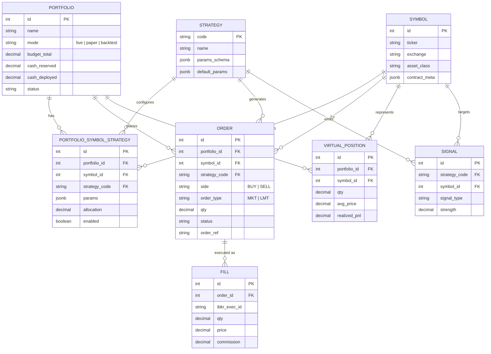
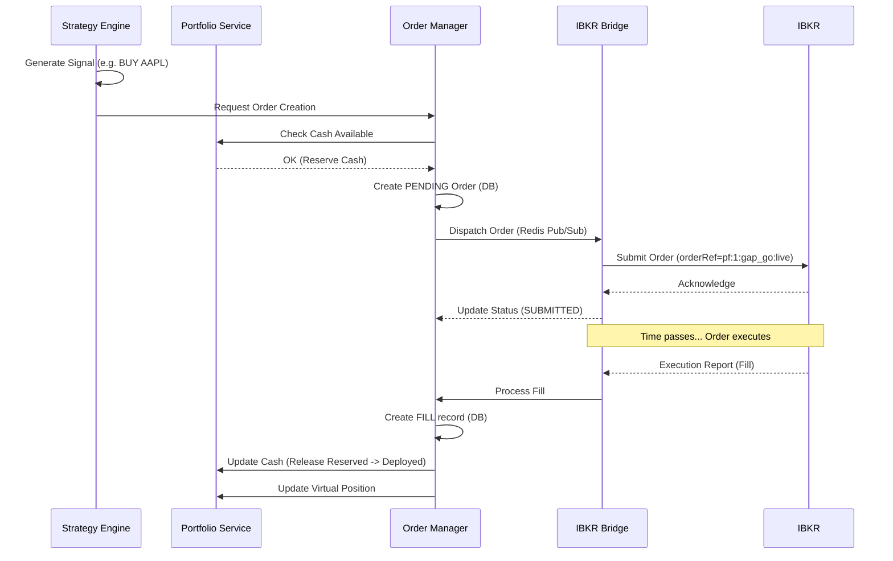

# AutoTrader Project Graphs

Here are the visual representations of the `simply-trade` platform you requested.

## Entity-Relationship (ER) Diagram

This diagram shows the core database models and their relationships, representing the foundation we built in Phase 1.

## System Architecture

This diagram shows the Docker orchestration and how the different services interact in the complete platform (Phases 0-9).

## Strategy Execution Flow (Phase 5+)

This sequence diagram illustrates how a strategy executes and interacts with the cash accounting system and IBKR bridge.

