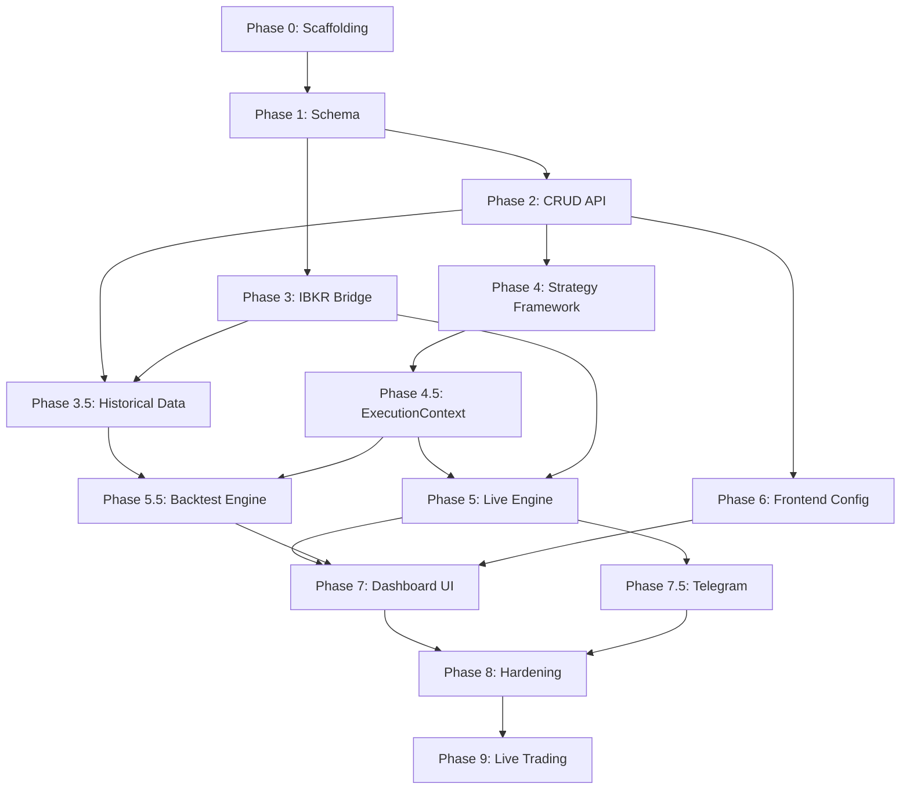

# AutoTrader Platform — Implementation Plan

> Based on [autotrader_platform_design.md](file:///Users/aamirsyed/Projects/botcoding/simply-trade/docs/autotrader_platform_design.md)

## Current State

The repo is **greenfield** — only `CLAUDE.md` and `docs/autotrader_platform_design.md` exist. Everything below is net-new.

---

## Repo Layout (Target)

```
simply-trade/
├── backend/
│   ├── app/
│   │   ├── __init__.py
│   │   ├── main.py                    # FastAPI app factory
│   │   ├── config.py                  # Pydantic Settings
│   │   ├── database.py                # async engine + session
│   │   ├── models/                    # SQLAlchemy 2.0 models
│   │   │   ├── portfolio.py
│   │   │   ├── symbol.py
│   │   │   ├── strategy.py
│   │   │   ├── assignment.py          # PortfolioSymbolStrategy
│   │   │   ├── order.py
│   │   │   ├── fill.py
│   │   │   ├── position.py            # VirtualPosition
│   │   │   ├── signal.py
│   │   │   ├── backtest.py
│   │   │   └── historical_bar.py
│   │   ├── schemas/                   # Pydantic request/response
│   │   ├── api/                       # FastAPI routers
│   │   │   ├── portfolios.py
│   │   │   ├── symbols.py
│   │   │   ├── strategies.py
│   │   │   ├── assignments.py
│   │   │   ├── orders.py
│   │   │   ├── positions.py
│   │   │   ├── account.py
│   │   │   ├── dashboard.py
│   │   │   ├── backtests.py
│   │   │   ├── historical.py
│   │   │   └── ops.py
│   │   ├── services/                  # Business logic
│   │   │   ├── portfolio_service.py
│   │   │   ├── order_service.py
│   │   │   ├── market_data_service.py
│   │   │   ├── notification_service.py
│   │   │   └── reconciliation_service.py
│   │   ├── strategies/                # Strategy framework
│   │   │   ├── base.py                # BaseStrategy + registry
│   │   │   ├── context.py             # ExecutionContext
│   │   │   ├── routers.py             # OrderRouter implementations
│   │   │   ├── clocks.py              # WallClock, SimulatedClock
│   │   │   ├── data_sources.py        # Live, Replay
│   │   │   ├── gap_and_go.py
│   │   │   ├── bull_flag.py
│   │   │   ├── vwap_reclaim.py
│   │   │   ├── sentiment_momentum.py
│   │   │   ├── mean_reversion.py
│   │   │   └── opening_range.py
│   │   ├── bridge/                    # IBKR bridge service
│   │   │   ├── __init__.py
│   │   │   ├── bridge.py              # Main bridge process
│   │   │   ├── connection.py          # ib_insync wrapper
│   │   │   └── events.py             # Redis pub/sub events
│   │   ├── workers/                   # Celery tasks
│   │   │   ├── celery_app.py
│   │   │   ├── strategy_runner.py
│   │   │   ├── backtest_runner.py
│   │   │   └── reconciliation.py
│   │   └── backtest/                  # Backtest engine
│   │       ├── engine.py
│   │       ├── simulated_router.py
│   │       └── metrics.py
│   ├── migrations/                    # Alembic
│   ├── tests/
│   ├── alembic.ini
│   ├── pyproject.toml
│   ├── Dockerfile
│   └── requirements.txt
├── frontend/                          # Vite + React + TS
│   ├── src/
│   │   ├── api/                       # Generated OpenAPI client
│   │   ├── components/
│   │   ├── pages/
│   │   ├── hooks/
│   │   └── App.tsx
│   ├── package.json
│   └── Dockerfile
├── docker-compose.yml
├── docker-compose.override.yml       # Dev overrides
├── .env.example
├── .pre-commit-config.yaml
├── CLAUDE.md
└── docs/
```

---

## Phase 0 — Repo & Docker Scaffolding

### Goal
Monorepo with all services booting via `docker compose up`. No application logic yet — just the skeleton.

### Deliverables

#### [NEW] `docker-compose.yml`
- Services: `api`, `worker`, `beat`, `ibkr-bridge`, `postgres`, `redis`, `frontend`
- `tws-gateway-paper` and `tws-gateway-live` stubs (commented out until Phase 3). Uses **official IB Gateway installer** (not third-party Docker images).
- Shared `.env` for `DATABASE_URL`, `REDIS_URL`, `LIVE_TRADING_ENABLED`

#### [NEW] `backend/pyproject.toml`
- Dependencies: `fastapi`, `uvicorn`, `sqlalchemy[asyncio]`, `asyncpg`, `alembic`, `pydantic`, `pydantic-settings`, `celery[redis]`, `redis`, `ib_insync`, `httpx`
- Dev deps: `ruff`, `mypy`, `pytest`, `pytest-asyncio`

#### [NEW] `backend/Dockerfile`
- Python 3.12 slim, install deps, copy app

#### [NEW] `backend/app/main.py`
- FastAPI app with `/health` endpoint returning `{"status": "ok"}`

#### [NEW] `backend/app/config.py`
- Pydantic `Settings` class: `DATABASE_URL`, `REDIS_URL`, `LIVE_TRADING_ENABLED`, `TELEGRAM_BOT_TOKEN`, `TELEGRAM_CHAT_ID`

#### [NEW] `frontend/` scaffold
- `npx -y create-vite@latest ./ --template react-ts` (non-interactive)
- Add `Dockerfile` (node build + nginx serve)

#### [NEW] `.pre-commit-config.yaml`
- ruff (lint + format), mypy, eslint

#### [NEW] `.env.example`

### Verification
- `docker compose up` → all services healthy
- `curl localhost:8000/health` → `200`
- `curl localhost:5173` → Vite default page

---

## Phase 1 — Schema & Migrations

### Goal
All SQLAlchemy 2.0 async models, Alembic baseline migration, seed script.

### Deliverables

#### [NEW] `backend/app/database.py`
- `create_async_engine`, `async_sessionmaker`, `get_db` dependency

#### [NEW] `backend/app/models/*.py`
All models from §4.1:
- `Portfolio` — with `budget_total`, `cash_reserved`, `cash_deployed`, computed `cash_available`, `mode` enum (PAPER/LIVE), `ibkr_account_code` nullable
- `Symbol` — `ticker`, `exchange`, `asset_class`, `contract_meta` (JSONB)
- `Strategy` — `code` PK, `name`, `description`, `default_params` (JSONB), `params_schema` (JSONB)
- `PortfolioSymbolStrategy` — FK to portfolio, symbol, strategy; `params` (JSONB), `allocation`, `enabled`
- `Order` — `order_type` constrained to `MKT`/`LMT`, `order_ref`, `reserved_cash`, `portfolio_id` NOT NULL
- `Fill` — linked to Order, `ibkr_exec_id`, `qty`, `price`, `commission`
- `VirtualPosition` — unique on `(portfolio_id, symbol_id)`, `qty`, `avg_price`, `realized_pnl`, `unrealized_pnl`
- `Signal` / `TradeLog`
- `Backtest`, `BacktestResult`
- `HistoricalBar` — indexed on `(symbol_id, timeframe, ts)`

> [!IMPORTANT]
> Check constraints: `cash_reserved >= 0`, `cash_deployed >= 0`. The `cash_available` computed column also must be `>= 0`.

#### [NEW] `backend/migrations/` (Alembic)
- `alembic init`, configure for async
- Baseline migration creating all tables

#### [NEW] `backend/app/seed.py`
- 1 demo portfolio (paper mode, $100k budget)
- 5 symbols (AAPL, MSFT, TSLA, GOOGL, AMZN)
- 6 strategies registered with default params + JSON schemas

### Verification
- `alembic upgrade head` succeeds
- `python -m app.seed` populates tables
- `pytest` — model unit tests (create, read, check constraints)

---

## Phase 2 — Core CRUD + Swagger

### Goal
Full REST API for configuration. Swagger at `/docs`. Cash invariant validation on every write.

### Deliverables

#### [NEW] `backend/app/schemas/*.py`
Pydantic v2 request/response models for all entities.

#### [NEW] `backend/app/api/portfolios.py`
- `GET/POST /portfolios`, `GET/PATCH/DELETE /portfolios/{id}`
- `GET /portfolios/{id}/summary` — budget breakdown + day PnL
- `PATCH /portfolios/{id}/mode` — guarded mode flip (reject if `LIVE_TRADING_ENABLED=false`)
- `POST /portfolios/{id}/clone-as-paper`

#### [NEW] `backend/app/api/symbols.py`
- `GET/POST /portfolios/{id}/symbols`, `DELETE /portfolios/{id}/symbols/{symbol_id}`
- Cross-portfolio symbol overlap warning logged

#### [NEW] `backend/app/api/strategies.py`
- `GET /strategies`, `GET /strategies/{code}` — read-only from registry

#### [NEW] `backend/app/api/assignments.py`
- Full CRUD under `/portfolios/{id}/assignments`
- Validate allocation doesn't exceed portfolio budget

#### [NEW] `backend/app/api/orders.py`
- `GET /orders` (filterable), `POST /orders/{id}/cancel`

#### [NEW] `backend/app/api/positions.py`
- `GET /positions`, `GET /positions/by-portfolio/{id}`

#### [NEW] `backend/app/api/ops.py`
- `GET /health`, `GET /ibkr/status` (stub), `POST /ops/kill-switch` (stub)

#### [NEW] `backend/app/services/portfolio_service.py`
- Cash invariant enforcement on every mutation
- `cash_available = budget_total - cash_reserved - cash_deployed >= 0`

### Verification
- Swagger UI at `/docs` shows all endpoints
- `pytest` — CRUD integration tests (create portfolio, add symbol, assign strategy, check cash validation rejects over-budget)
- Negative test: allocation exceeding budget rejected with 422

---

## Phase 3 — IBKR Bridge

### Goal
Long-lived bridge process holding `ib_insync` connections. Order placement with mandatory `orderRef` tagging. Redis pub/sub for fill events.

### Deliverables

#### [NEW] `backend/app/bridge/connection.py`
- `IBKRConnection` class wrapping `ib_insync.IB`
- Paper (7497) and live (7496) connections
- Auto-reconnect with backoff
- `account_summary()`, `positions()`, `place_order()`, `cancel_order()`

#### [NEW] `backend/app/bridge/bridge.py`
- Main bridge process (standalone, run via `python -m app.bridge.bridge`)
- Listens for order requests on Redis queue
- Enforces `orderRef` format: `pf:{portfolio_id}:{strategy_code}:{mode}`
- **Account-level pre-trade check**: `SUM(cash_reserved + cash_deployed) + notional <= buying_power * 0.95`
- Publishes fill events, order status updates, connection status to Redis pub/sub

#### [NEW] `backend/app/bridge/events.py`
- Redis pub/sub channel definitions
- Event schemas: `FillEvent`, `OrderStatusEvent`, `ConnectionStatusEvent`

#### [MODIFY] `backend/app/api/ops.py`
- Wire `/ibkr/status` to bridge connection state
- Wire kill-switch to cancel all via bridge

#### [MODIFY] `docker-compose.yml`
- Add `ibkr-bridge` service
- Uncomment `tws-gateway-paper` service (official IB Gateway installer, not third-party images)

### Verification
- Bridge connects to paper TWS gateway
- Place a test order via Redis → bridge submits with correct `orderRef` → fill event published
- Bridge rejects order without `portfolio_id`
- Account buying-power check blocks over-limit order

---

## Phase 3.5 — Historical Data Layer

### Goal
`MarketDataService` with IBKR-only fetching, PostgreSQL caching, prefetch endpoint.

### Deliverables

#### [NEW] `backend/app/services/market_data_service.py`
- `get_bars(symbol, timeframe, start, end) -> DataFrame`
- Check `historical_bars` table for cached range
- Fetch missing slices via bridge's IBKR connection (`reqHistoricalData`)
- Respect IBKR pacing (~60 req / 10 min) with rate limiter
- Persist fetched bars, return concatenated frame

#### [NEW] `backend/app/api/historical.py`
- `GET /historical/coverage` — show cached date ranges per symbol/timeframe
- `POST /historical/prefetch` — bulk fetch request (queued as Celery task)

#### [NEW] `backend/app/workers/data_fetcher.py`
- Celery task for async prefetch jobs

### Verification
- Prefetch 1 month of AAPL 1-min bars → rows in `historical_bars`
- Second call for same range → returns from cache (no IBKR request)
- Coverage endpoint shows cached ranges

---

## Phase 4 — Strategy Framework

### Goal
`BaseStrategy`, decorator registry, JSON schema-driven params. All **six strategies fully implemented** (not stubs) to validate the full pipeline earlier.

### Deliverables

#### [NEW] `backend/app/strategies/base.py`
```python
class BaseStrategy(ABC):
    code: str
    name: str
    description: str
    ParamsModel: type[BaseModel]

    @abstractmethod
    def generate_signal(self, ctx: ExecutionContext) -> Signal | None: ...

    def on_bar(self, bar, ctx): ...
    def on_tick(self, tick, ctx): ...
    def on_news(self, item, ctx): ...

# Registry dict + @register_strategy decorator
```

#### [NEW] Six strategy files (fully implemented)
Each defines `ParamsModel` with JSON schema and a working `generate_signal` implementation:
- `gap_and_go.py` — gap detection at open with volume confirmation
- `bull_flag.py` — consolidation breakout after a strong impulse
- `vwap_reclaim.py` — pullback to VWAP with reclaim confirmation
- `sentiment_momentum.py` — news-driven entry (Google/Yahoo Finance); paper/live-only
- `mean_reversion.py` — z-score on a moving baseline; fade extremes
- `opening_range.py` — first N-minute range, breakout with volume

#### [MODIFY] `backend/app/api/strategies.py`
- Wire `GET /strategies` to live registry (returns code, name, description, `params_schema`)

#### [MODIFY] `backend/app/seed.py`
- Auto-register strategies from registry instead of manual inserts

### Verification
- `GET /strategies` returns 6 strategies with valid JSON schemas
- Instantiate each strategy with default params — no errors
- Each strategy's `generate_signal` produces valid signals given appropriate bar data
- Unit tests per strategy with known input → expected signal output

---

## Phase 4.5 — ExecutionContext Abstraction

> [!IMPORTANT]
> This is the most important abstraction in the system. Do not skip or shortcut.

### Goal
Three execution modes sharing identical strategy code via `ExecutionContext`.

### Deliverables

#### [NEW] `backend/app/strategies/context.py`
```python
@dataclass
class ExecutionContext:
    clock: Clock
    data: MarketDataSource
    router: OrderRouter
    portfolio_id: int | None
    mode: Literal["live", "paper", "backtest"]
```

#### [NEW] `backend/app/strategies/clocks.py`
- `WallClock` — `now()` returns real time
- `SimulatedClock` — `now()` returns simulated time, `advance_to(ts)`

#### [NEW] `backend/app/strategies/data_sources.py`
- `LiveDataSource` — wraps IBKR streaming via bridge
- `ReplayDataSource` — iterates cached `HistoricalBar` rows

#### [NEW] `backend/app/strategies/routers.py`
- `OrderRouter` ABC: `place_order()`, `cancel_order()`, `get_position()`
- `IBKRLiveRouter` — submits to bridge on port 7496, enforces `orderRef`
- `IBKRPaperRouter` — submits to bridge on port 7497, enforces `orderRef`
- `SimulatedRouter` — in-process fill simulation (used by backtest)
- All routers reject orders without `portfolio_id` + `strategy_code`
- All routers enforce `MKT`/`LMT` only

#### [NEW] `backend/app/strategies/signals.py`
- `Signal` dataclass: `direction`, `symbol`, `qty`, `order_type`, `limit_price`, `reason`

### Verification
- Unit test: same strategy instance produces identical signal given identical bar data through all three context types
- Router refuses order without `orderRef` fields
- SimulatedRouter fills at `next_bar_open` by default

---

## Phase 5 — Live Execution Engine

### Goal
Celery Beat schedules strategy runs. OrderManager handles fills and updates VirtualPosition + cash atomically. End-to-end paper trade.

### Deliverables

#### [NEW] `backend/app/workers/celery_app.py`
- Celery app configured with Redis broker

#### [NEW] `backend/app/workers/strategy_runner.py`
- `run_strategy_tick(assignment_id)` task
- Loads assignment → builds `ExecutionContext` (paper or live) → calls `strategy.on_bar()` / `generate_signal()` → places order if signal

#### [NEW] `backend/app/services/order_service.py`
- `OrderManager`:
  - Pre-trade checks: cash availability, position limits, market hours, order type validation
  - Reserve cash on submission (`cash_reserved += notional`)
  - On fill: update `VirtualPosition` (FIFO), adjust `cash_reserved` → `cash_deployed`, record `Fill`
  - On cancel: release `cash_reserved`
  - All updates in a single DB transaction

#### [MODIFY] `backend/app/workers/celery_app.py`
- Beat schedule: run enabled assignments every minute during market hours (9:30–16:00 ET weekdays)

#### [NEW] `backend/app/workers/fill_handler.py`
- Listens to Redis fill events from bridge
- Routes to `OrderManager.handle_fill()`

### Verification
- Create portfolio + assignment → Beat triggers strategy run → order placed on paper TWS → fill received → VirtualPosition updated → cash columns correct
- Pre-trade check rejects order exceeding `cash_available`
- Cancel order → `cash_reserved` released

---

## Phase 5.5 — Backtest Engine

### Goal
`SimulatedRouter` with fill models, metrics computation, results persistence.

### Deliverables

#### [NEW] `backend/app/backtest/engine.py`
- `run_backtest(backtest_id)` Celery task
- Loads config, ensures historical data, builds `ExecutionContext` with `SimulatedClock` + `ReplayDataSource` + `SimulatedRouter`
- Iterates bars, calls strategy, matches pending orders, records equity snapshots

#### [NEW] `backend/app/backtest/simulated_router.py`
- `SimulatedRouter`:
  - `initial_cash`, tracks cash + positions internally
  - Fill models: `next_bar_open` (default), `bar_close`, `midpoint`
  - Configurable `slippage_bps` and `commission_model` (IBKR tiered approx)
  - `match_pending_orders(bar)` — fills pending orders based on model
  - `trade_log` — list of all simulated fills

#### [NEW] `backend/app/backtest/metrics.py`
- Compute: Sharpe, Sortino, Calmar, CAGR, max drawdown, win rate, profit factor, expectancy, avg holding period, exposure %
- Per-symbol breakdown
- Equity curve + drawdown curve as time series

#### [NEW] `backend/app/api/backtests.py`
- `POST /backtests` — create + enqueue
- `GET /backtests`, `GET /backtests/{id}`
- `GET /backtests/{id}/equity`, `GET /backtests/{id}/trades`
- `DELETE /backtests/{id}`

### Verification
- Run backtest with VWAP Reclaim on 3 months AAPL → results persisted
- Equity curve has correct shape, metrics are sane
- `next_bar_open` fill model avoids look-ahead (no fill on signal bar)

---

## Phase 6 — Frontend Config UI

### Goal
React frontend with portfolio management, symbol configuration, strategy assignment with dynamic param forms.

### Deliverables

#### Frontend scaffold
- Install deps: `@tanstack/react-query`, **shadcn/ui** + Tailwind CSS + Radix UI, `react-router-dom`
- Generate API client from OpenAPI schema

#### Pages
- **Portfolios list** — cards showing name, mode badge (LIVE/PAPER), budget, cash_available, day PnL. Create/edit modals.
- **Portfolio detail** — symbols table, per-symbol strategy dropdown, dynamic params form (rendered from JSON schema), allocation field. Cash panel (reserved/deployed/available).
- **Strategies catalog** — read-only cards with description, default params.
- **Mode flip** — typed confirmation dialog ("type LIVE to confirm")

#### Shared components
- `CashPanel` — budget breakdown bar chart
- `StrategyParamsForm` — dynamic form from JSON schema
- `ModeBadge` — LIVE (red) / PAPER (green) pill
- App shell with sidebar nav

### Verification
- Create portfolio → add symbols → assign strategies with custom params → all persisted via API
- Cash panel updates correctly
- Mode flip requires typed confirmation

---

## Phase 7 — Dashboard + Backtest UI

### Goal
Live dashboard with positions, equity, IBKR status. Backtest configuration and results UI. Reconciliation view.

### Deliverables

#### Dashboard page
- Overview cards: total equity, day PnL, open positions count
- Equity curve (TradingView Lightweight Charts)
- Open orders table, recent fills
- IBKR connection status indicator
- Shared-account banner: IBKR buying power vs sum-of-portfolio commitments

#### Backtest page
- Config form: strategy, symbols (multi-select), params, date range, capital, fill model, slippage
- Job progress indicator
- Results: equity curve, drawdown chart, trade overlay on price chart, metrics card

#### Compare backtests page
- Select N backtest runs → overlay equity curves

#### Reconciliation view
- Side-by-side: virtual positions per portfolio vs IBKR netted positions
- Highlight drift rows

#### Orders / Trade log
- Filterable table (by portfolio, symbol, date, status)
- CSV export

### Verification
- Dashboard shows live data from paper trading
- Backtest form → submit → progress → results render with charts
- Reconciliation view correctly compares virtual vs broker positions

---

## Phase 7.5 — Telegram Notifications

### Goal
`NotificationService` with Telegram bot. Configurable per event type.

### Deliverables

#### [NEW] `backend/app/services/notification_service.py`
- `NotificationService` ABC with `send(event_type, message)` 
- `TelegramNotifier` implementation using `httpx` + Telegram Bot API
- Event types: `fill`, `signal`, `daily_pnl`, `risk_breach`, `kill_switch`, `recon_drift`, `bridge_disconnect`

#### Integration points
- `OrderManager.handle_fill()` → notify on fill
- Kill-switch endpoint → notify on activation
- Reconciliation job → notify on drift
- Bridge → notify on disconnect/reconnect
- Beat → daily PnL summary after market close

#### Frontend
- **Notification settings page** — Telegram config (token, chat ID), toggle per event type

### Verification
- Place order on paper → fill → Telegram message received
- Trigger kill-switch → Telegram alert
- Settings UI saves preferences

---

## Phase 8 — Hardening

### Goal
Kill switch, structured logging, Prometheus metrics, EOD reconciliation, paper-default enforcement.

### Deliverables

#### Kill switch (`POST /ops/kill-switch`)
- Cancel all open orders via bridge
- Disable all assignments (`enabled = false`)
- Notify via Telegram
- Frontend: big red button in dashboard header

#### Structured logging
- `structlog` with JSON output to stdout
- Request-ID middleware in FastAPI
- Every signal logs strategy version

#### Prometheus metrics
- Orders placed/filled/cancelled counters
- Strategy run latency histogram
- Bridge connection state gauge
- Account margin headroom gauge
- Per-portfolio cash-available gauge

#### [NEW] `backend/app/workers/reconciliation.py`
EOD Celery task (scheduled after 16:30 ET):
1. Position recon: `SUM(VirtualPosition.qty)` vs IBKR per symbol
2. Cash recon: realized PnL vs IBKR NAV change
3. Order recon: match all IBKR executions to `Fill` rows
4. Log drift, surface in Reconciliation view, Telegram alert

#### Paper-default enforcement
- New portfolios always start in `paper` mode (model default)
- API rejects mode flip to `live` unless `LIVE_TRADING_ENABLED=true`

### Verification
- Kill switch cancels all orders, disables assignments, sends Telegram alert
- Prometheus metrics visible at `/metrics`
- EOD recon job runs, detects injected drift, alerts

---

## Phase 9 — Live Trading Enablement

### Goal
Live TWS gateway, mode-flip flow, alerting, operational runbook.

### Deliverables

#### [MODIFY] `docker-compose.yml`
- `tws-gateway-live` service (port 7496), only starts when `LIVE_TRADING_ENABLED=true`

#### [MODIFY] Bridge
- Connect to live gateway when available
- Route orders based on portfolio mode (paper → 7497, live → 7496)

#### Mode flip flow
- API: `PATCH /portfolios/{id}/mode` with `confirmation_text` field
- Frontend: typed confirmation ("type LIVE to confirm"), warning dialog
- Requires `LIVE_TRADING_ENABLED=true` env var

#### Account-level circuit breaker
- Auto kill-switch if account day PnL crosses `-3% of equity`

#### [NEW] `docs/runbook.md`
- Startup/shutdown procedures
- Emergency procedures (kill switch, manual TWS)
- Monitoring checklist
- Known failure modes

### Verification
- Full end-to-end: paper portfolio → backtest → compare → flip to live → live order executed → fill recorded → positions correct
- Circuit breaker fires on simulated large loss
- Runbook reviewed and complete

---

## Dependency Graph



---

## Resolved Decisions

| # | Question | Decision |
|---|---|---|
| 1 | Frontend component library | **shadcn/ui** (Tailwind + Radix). More control, lighter bundle. |
| 2 | TWS Gateway Docker image | **Official IB Gateway installer**. No third-party images. |
| 3 | Strategy implementation scope | **All 6 strategies fully implemented** in Phase 4 (not stubs) to validate the full pipeline earlier. |
| 4 | CI/CD | **Deferred**. Running locally for now; CI can be added in a later phase. |
